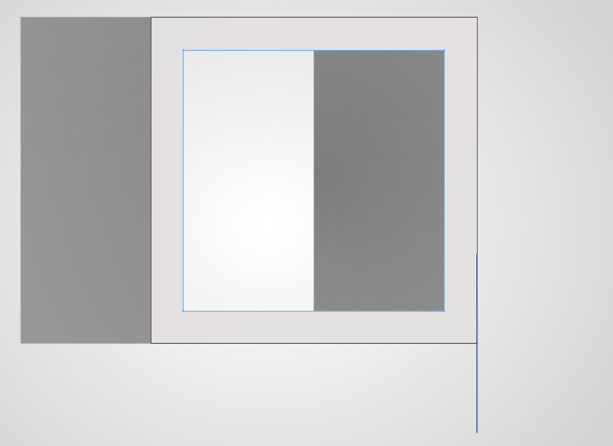
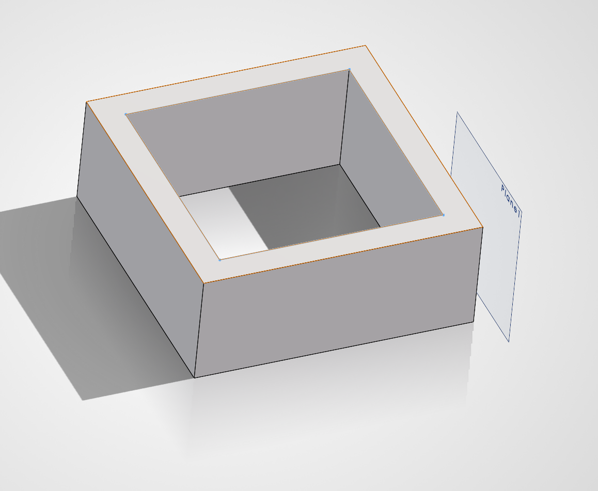

# A3 – Design Something Small

## Design

I designed something for me to fidget with during class time. As a student with adhd, having something in my hand can increase my ability to focus on instruction. I made a hollowed square because I prefer to have something with clear defined edges. I started with a rectangle shape but I chose to go with a square due to the easier ability to roll within my hand and better control so I won't drop it. The hollow natural of the fidget was to allow for easier maneuverability.

  
  

## Research

# Concentric

This is an infill that traces the perimeter of the print and gets smaller as it reaches the center. This is best for flexible or transparent prints. (ex: miniature tires for toy model cars)

# Hilbert Curve

The hilbert curve is pattern that is rectangular but it has large spaces that make it optimal for filling it with epoxy or resin.

# Archimedean Chords

This pattern has a similar style to the Concentric, this uses a circular shape as oppose to a perimeter tracing shape. This would allow for more flexibility like the concentric but also allows for optimized filling for materials such as resin and epoxy.

# How does infill percentage affect mechanical properties, and how do different infill patterns affect mechanical properties?

Infill percentage will mostly affect how the compression will effect a model. This is because higher infill percentage means a high level of support around the neutral axis of the model. How the infill percentage affects the strength of the model is not linear. Different infill patterns will affect mechanical properties of a model such as flexibility or the model's ability to take filler material. This is because based on the pattern, some can assist in tensile strength in one direction, but not the other. Think of a standard line pattern. parallel to the length of a rectangle. If you apply force on the width of the rectangle, there would be a much higher resistance to deformation than if force was applied on the length of the rectangle.
## Preprocessor and Printing

The build was set in a way that would allow for it to be printed without any supports to reduce build time. I did not need to scale my build because I designed the model within the set parameters of the assignment. I used a 15% infill with a diagonal pattern for the minimal need for tensile strength from the low load of force it would be placed under during usage. The wall thickness was reduced to allow for the infill to be effectively used due to the narrow natural of the model. I was not worried about having to reduce the wall thickness however because I knew the model was not going to be under substantial stress and therefore, wouldn't be concerned about deformation. So this would allow for a better produciton of the infill, as well as save material and print time.

## Print

## Lessons Learned

